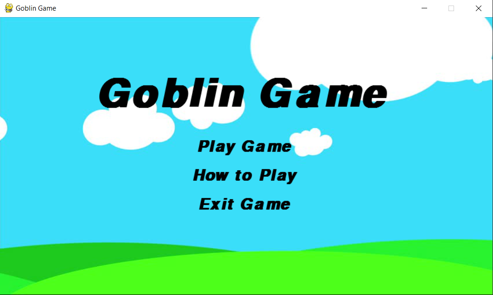
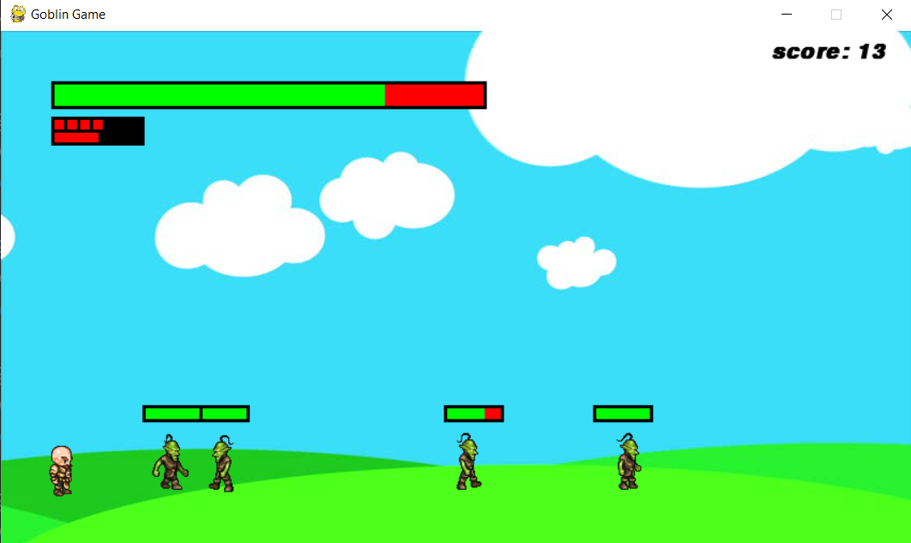

# Goblin Game :boom::boom:

## Table of Contents
1. [Game description](#game-description)
2. [Display pictures](display-pictures)
3. [About the Code](#about-the-code) 
    - [Music and Sound effects](#sound-effects)
    - [Walking effect of player](#walking-effect-of-the-player)
4. [References](#references)

<br><br><br><br>
### <center>Game Description</center><br><br>
This is a single player game.The goal of the game is simple - survive.In order to survive you must kill the enemy goblins before they try to kill you.By killing the goblins you get more score.<br><br>To kill the goblin you can use your plasma gun or your plasma bomb.The plasma bomb can kill all the goblins present, but it takes time to reload the bome so use it wisely.After some time you will also get a health box to increase your health.More information on How to play the game can be found in the 'How to Play' section in the game's main menu<br><br><br><br>

### <center>Display Pictures</center><br><br>

<br>

### <center>About the Code</center><br><br>

#### Sound effects
This game uses a lot of sound effects.There is a music in the background and sounds for bullet shooting,bullet hitting,jumping and bomb explosion.
<br>
First of all you should have a music file (format - mp3,wav,ogg).For the background music you should have a longer file and for the sound effects you should have a shorter music file.
After you have your music files, you need to load them as Sound objects in the program.Background music and sound effects are loaded and played differently.<br>For the background music - <br>
```background_music = pygame.mixer.music.load(os.path.join(os.path.dirname(__file__),background_music_file_name.extension))```<br>
here ```background_music``` is the Sound object which can be used to play the sound.<br>
and ```background_music_file_name.extension``` is the name of our music file with extension(example - music.mp3)<br>
For the Sound effects - <br>
```sound_effect = pygame.mixer.Sound(os.path.join(os.path.dirname(__file__),"filename.wav"))```<br>
here ```sound_effect``` is the Sound object which can be used to play the sound.<br><br>
Now we have just loaded the sounds. Now lets see how to play them.<br>
To play the background music we can use - <br>
```pygame.mixer.music.play(loops=0, start=0.0, fade_ms = 0)```<br>
here,<br>
loops - number of times the music should repeat. It's default value is 0.To play the music on an infinite loop set loops=-1.<br>
start - denotes the position in time, the music starts playing from. Which is 0.0 by default.<br>
fade_ms - makes the music start playing at 0 volume and fade up to full volume over the given time.<br>
All these are optional arguments.
<br><br><br><br>
#### Walking effect of the player
When the player is moving the player appears to be walking. This can be done using 10-15 images of the character, each of which is slightly different than the previous image.These images which are used in this project can be found here. Then all we need to do is whenever the player is moved we display the slightly different image at a position  little ahead of the previous position. In order to keep track of all these images we can make use a List image_list and then just display the image_list[i].Now if we have to change the image all we need do is change the index i to (i+1)%(number_of_images).   
<br><br><br><br>
### <center>References</center><br><br>
Here are some references for learning more about this project.<br>
For pygame functions and examples
- [pygame documentaion](https://www.pygame.org/docs/)
